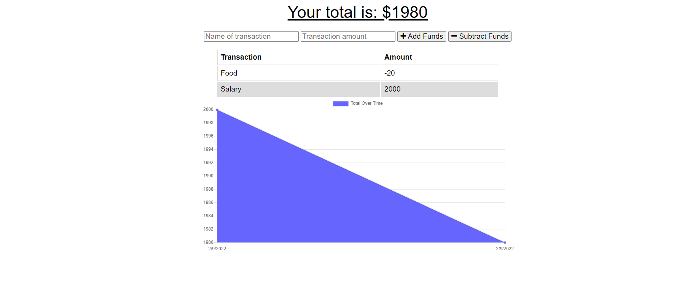

# online-offline-budget-trackers

Budget tracking application to allow for offline access and functionality. If the network is offline, a failed post to the database will result in a IndexedDB object store. Once the navigator is back online, the offline object will be used for a bulk create post.

# Screenshot

# Heroku

https://lit-river-41051.herokuapp.com/
